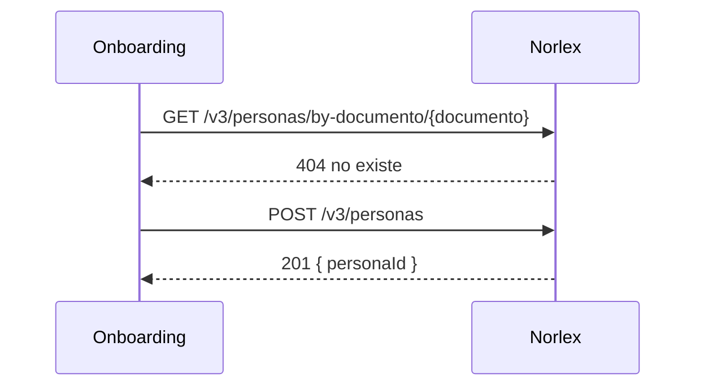

> Ejemplo ilustrativo — cifras, nombres de endpoints y organizaciones ficticios, no datos reales de Bind PSP.

# Análisis técnico-funcional: Alta de comercio en el repositorio documental del proveedor Norlex

## 1. Alcance del análisis y estado

Cubre la creación online de la persona/comercio en Norlex y la carga del primer documento de identidad al momento del alta. No cubre la migración de comercios ya existentes ni la descarga de documentos previamente cargados (queda fuera de este análisis, ver sección 12). Trabajado sobre la especificación pública de Norlex versión 3.2 (312 endpoints), obtenida el 2026-08-10.

## 2. Actores y sistemas participantes

| Sistema/Actor | Rol en el flujo | Dueño | Quién construye |
| --- | --- | --- | --- |
| Onboarding (Bind PSP) | Orquesta el alta y dispara las llamadas a Norlex | Bind PSP | Equipo Onboarding |
| Norlex (proveedor externo) | Repositorio documental de cumplimiento | Norlex | N/A (proveedor) |
| Backoffice (Bind PSP) | Consulta el estado del legajo cargado | Bind PSP | Equipo Backoffice |
| Batch nocturno `REPORTE_CLIENTES` | Mecanismo actual de reporte a Norlex, en producción | Bind PSP | Equipo de Datos |

## 3. Disparador y punto de enganche

El disparador es el evento "comercio aprobado" que ya emite Onboarding al cierre de la Etapa 3 de su flujo actual (validación de identidad completa). Esta solución se engancha ahí: inmediatamente después de ese evento, antes de notificar al comercio que el alta terminó.

## 4. Contrato de integración

### 4.1 Crear persona — Confianza: Confirmado
- **Fuente:** especificación pública de Norlex v3.2, sección "Personas", endpoint `POST /v3/personas`.
- **Método y URL:** `POST https://api.norlex.com/v3/personas`
- **Autenticación:** Bearer token (OAuth2 client credentials)
- **Headers:** `Content-Type: application/json`, `X-Request-Id`
- **Request de ejemplo:**
```json
{ "documento": "20-12345678-9", "tipoDocumento": "CUIT", "razonSocial": "Comercio Ejemplo SRL" }
```
- **Response de ejemplo (éxito):**
```json
{ "personaId": "per_8f21", "estado": "activa" }
```
- **Códigos de respuesta:** `201` alta exitosa · `409` ya existe una persona con ese documento
- **Idempotencia:** no documentada — ver gap G1 (sección 12)
- **Ambientes:** `sandbox.norlex.com` / `api.norlex.com`
- **Rate limit:** no documentado

### 4.2 Consultar persona por documento — Confianza: Confirmado
- **Fuente:** especificación pública de Norlex v3.2, endpoint `GET /v3/personas/by-documento/{documento}`.
- **Método y URL:** `GET https://api.norlex.com/v3/personas/by-documento/{documento}`
- **Response de ejemplo (éxito):** `{ "personaId": "per_8f21", "estado": "activa" }`
- **Códigos de respuesta:** `200` encontrada · `404` no existe

### 4.3 Descarga de documento ya cargado — Confianza: Verbal
- **Fuente:** confirmado por Norlex (contacto comercial) en llamada del 2026-08-12, sin documento de respaldo.
- Texto: Norlex confirmó que existe un endpoint de descarga pero no lo incluyó en la especificación pública compartida. Ver pedido de material P1 (sección 12).

## 5. Mapa de procedencia de datos

| Campo del request | Origen | Transformación | Obligatorio | Qué pasa si falta |
| --- | --- | --- | --- | --- |
| `documento` | CUIT ingresado por el comercio en el formulario de alta de Onboarding | Ninguna, se envía tal cual | Sí | Onboarding no permite avanzar sin CUIT validado — no debería llegar vacío |
| `tipoDocumento` | Derivado: siempre `"CUIT"` para comercios, hardcodeado por Onboarding | Constante | Sí | N/A, no depende de input |
| `razonSocial` | Campo "Razón social" del formulario de alta | Trim de espacios | Sí | Bloquea la llamada — se marca error de validación antes de llamar a Norlex |

## 6. Camino feliz



1. Onboarding consulta si la persona ya existe por documento → `404`.
2. Onboarding crea la persona → `201`, guarda `personaId`.

## 7. Caminos alternativos

### 7.1 La persona ya existe
Si la consulta del paso 1 devuelve `200`, Onboarding reutiliza el `personaId` existente y no vuelve a llamar a `POST /v3/personas` — evita el `409`.

## 8. Errores y flujos de error controlado

| ID | Condición | Origen | Detección | Acción del sistema | Reintento/backoff | Qué ve el usuario | Log/alerta |
| --- | --- | --- | --- | --- | --- | --- | --- |
| E1 | Norlex responde `409` en la creación pese a la consulta previa (condición de carrera) | Negocio | Código `409` en la respuesta | Reintenta la consulta por documento y reutiliza el `personaId` devuelto | 1 reintento inmediato | Ninguno, transparente | Log info, sin alerta |
| E2 | Timeout de red hacia Norlex | Transporte | Sin respuesta en 10s | Reintenta con backoff exponencial | 3 intentos, 2s/4s/8s | "Estamos procesando tu alta, te avisamos en breve" | Alerta si agota los 3 intentos |

## 9. Máquina de estados

No aplica — la persona en Norlex no tiene un ciclo de estados relevante para este flujo (queda `activa` desde la creación).

## 10. Convivencia con lo existente

El batch nocturno `REPORTE_CLIENTES` sigue corriendo sin cambios como mecanismo de reconciliación — la creación online no lo reemplaza, es un mecanismo adicional. Riesgo de duplicación si el batch intenta crear una persona ya dada de alta online: mitigado porque el batch ya hace su propia consulta previa por documento.

## 11. Decisiones de diseño, NFR y alternativas descartadas

### 11.1 Creación online vs. esperar el batch nocturno
- **Elegida:** creación online, inmediatamente al cierre de la Etapa 3 de Onboarding.
- **Descartadas:** esperar al batch nocturno — se descartó porque el comercio quedaría hasta 24hs sin legajo documental cargado en Norlex, bloqueando operaciones que Norlex valida en tiempo real.
- **Qué la invalidaría:** si Norlex confirma un límite de rate estricto que la creación online no puede sostener en horario pico.

### NFR y operación
- Volumetría: no definida aún por el PM.
- Latencia esperada: no definida aún por el PM.

## 12. Gaps técnicos, material pendiente y reparto por equipo

| Gap / Material pendiente | Severidad | ¿Bloqueante? | A quién se le pide | Qué pregunta desbloquea |
| --- | --- | --- | --- | --- |
| G1 — Idempotencia de `POST /v3/personas` no documentada | Media | No | Norlex (contacto técnico) | Si un reintento con el mismo body duplica la persona |
| P1 — Endpoint de descarga de documentos no está en la especificación pública | Alta | Sí, para la fase de descarga (fuera de alcance de este análisis) | Norlex (contacto comercial) | Contrato completo del endpoint de descarga |

### Reparto por equipo
| Sistema/Equipo | Qué construye |
| --- | --- |
| Onboarding | Llamadas a Norlex, manejo de E1/E2, guardado de `personaId` |
| Backoffice | Pantalla de consulta de estado del legajo |

---

**Historial de revisiones**
- v1.0 (2026-08-19): versión inicial.
