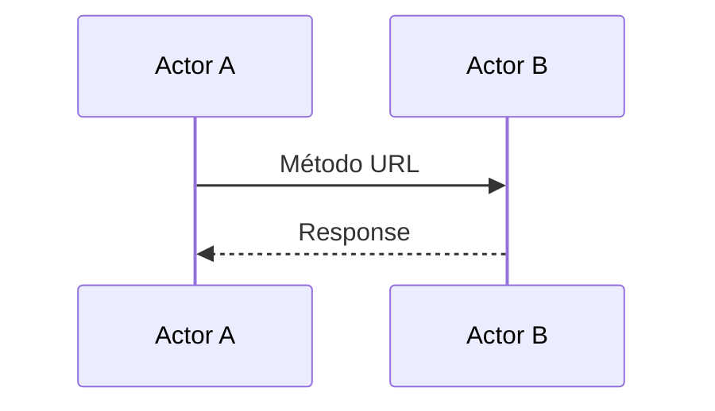
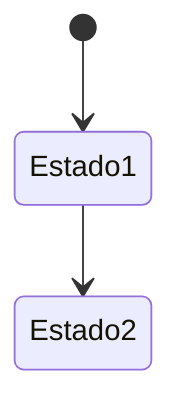

# Análisis técnico-funcional: [Nombre de la solución]

## 1. Alcance del análisis y estado
_// Qué se diseña acá, qué queda deliberadamente fuera, y sobre qué versión de la documentación del proveedor se trabajó (fecha, cantidad de endpoints u otra referencia de versión si aplica)._
Texto.

## 2. Actores y sistemas participantes
_// Todo sistema o actor que participa del flujo, con su rol, dueño y quién lo construye. Nivel de detalle de contexto: quién existe, no cómo está hecho por dentro._

| Sistema/Actor | Rol en el flujo | Dueño | Quién construye |
| --- | --- | --- | --- |
|  |  |  |  |

## 3. Disparador y punto de enganche
_// Qué evento inicia el flujo, quién lo invoca, si es sincrónico/asincrónico/batch, y en qué punto exacto de un flujo ya existente se engancha esta solución._
Texto.

## 4. Contrato de integración
_// Una subsección por operación. Cada campo con fuente citada y nivel de confianza: Confirmado (documentado) / Verbal (dicho por el proveedor sin documento) / Supuesto (hipótesis a validar)._

### 4.1 [Nombre de la operación] — Confianza: [Confirmado/Verbal/Supuesto]
- **Fuente:** _(archivo/sección o "confirmado por <quién> el <fecha>")_
- **Método y URL:**
- **Autenticación:**
- **Headers:**
- **Request de ejemplo:**
```json
{}
```
- **Response de ejemplo (éxito):**
```json
{}
```
- **Códigos de respuesta:**
- **Idempotencia:**
- **Ambientes:**
- **Rate limit:**

## 5. Mapa de procedencia de datos
_// De dónde sale cada campo del request. No dejarlo implícito en el contrato._

| Campo del request | Origen (sistema/tabla/pantalla/derivado) | Transformación | Obligatorio | Qué pasa si falta |
| --- | --- | --- | --- | --- |
|  |  |  | Sí/No |  |

## 6. Camino feliz
_// Diagrama de secuencia con la operación real nombrada en cada flecha, nunca una descripción genérica. Debajo, pasos numerados con ejemplo real de request/response por paso._



1. _Paso 1 — request/response de ejemplo._

## 7. Caminos alternativos
_// Ramas de negocio que no son el camino feliz pero tampoco son error (ej. "el recurso ya existe, se actualiza en vez de crearse"). Numeradas igual que el camino feliz._

### 7.1 [Nombre del camino alternativo]
Texto + diagrama si aplica.

## 8. Errores y flujos de error controlado
_// Un error conocido = una fila. No un genérico "maneja errores"._

| ID | Condición | Origen | Detección | Acción del sistema | Reintento/backoff | Compensación/rollback | Qué ve el usuario | Log/alerta |
| --- | --- | --- | --- | --- | --- | --- | --- | --- |
| E1 |  | Transporte/Negocio/Dato faltante |  |  |  |  |  |  |

## 9. Máquina de estados
_// Solo si la entidad principal del flujo tiene estados. Si no aplica, marcar "No aplica — <razón>"._



## 10. Convivencia con lo existente
_// Qué mecanismo actual se conserva, cuál se duplica temporalmente, cuál se reemplaza — con fecha o condición de corte si aplica._
Texto.

## 11. Decisiones de diseño, NFR y alternativas descartadas
_// ADR-lite: opción elegida, descartadas y por qué, qué la invalidaría. NFR solo si el PM o el PRD ya los definieron — no inventar SLAs._

### 11.1 [Decisión]
- **Elegida:**
- **Descartadas:** _(y por qué)_
- **Qué la invalidaría:**

### NFR y operación
_// Solo completar lo que ya está definido. Marcar "No definido aún" en vez de inventar un número._
- Volumetría:
- Latencia esperada:
- Ventanas horarias:
- Observabilidad/alertas:
- Retención / PII / PCI:

## 12. Gaps técnicos, material pendiente y reparto por equipo
_// Todo lo que quedó como pregunta sin resolver o pedido de material sin responder, con severidad y si es bloqueante. Y qué construye cada sistema/equipo._

| Gap / Material pendiente | Severidad | ¿Bloqueante? | A quién se le pide | Qué pregunta desbloquea |
| --- | --- | --- | --- | --- |
|  | Alta/Media/Baja | Sí/No |  |  |

### Reparto por equipo
| Sistema/Equipo | Qué construye |
| --- | --- |
|  |  |

---

**Historial de revisiones**
- v1.0 (YYYY-MM-DD): versión inicial.
