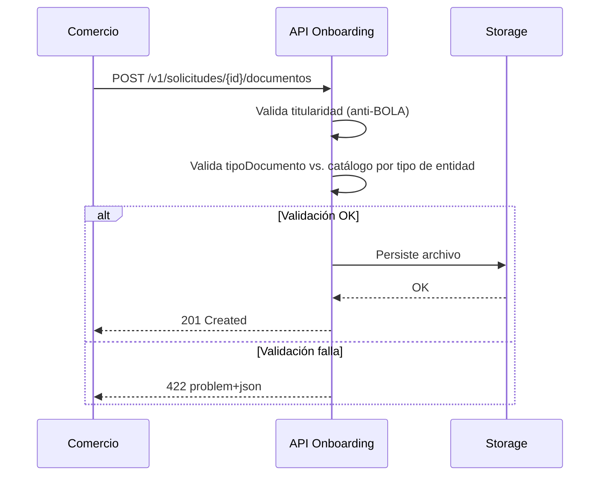

# Historias de usuario: Preview de documentación KYB

## US-1: Ver documentos requeridos antes de cargar

| Campo | Valor |
|-------|-------|
| ID | US-1 |
| Título | Preview de documentos requeridos |
| Persona | Comercio dando de alta su cuenta de Adquirencia |
| Prioridad | P0 |
| Epic/Feature | Preview de documentación KYB |
| Estimación | [Ejemplo] 5 puntos |

### Enunciado

**Como** comercio dando de alta mi cuenta,

**quiero** ver qué documentos me van a pedir antes de empezar a cargarlos,

**para** poder juntarlos con anticipación y no abandonar el trámite a mitad de camino.

### Contexto y antecedentes

Ver PRD de ejemplo — el 58% de abandono en el paso de KYB se atribuye en parte a que el comercio no sabe qué le van a pedir hasta que ya está en el formulario de carga.

### Criterios de aceptación

#### AC-1: Se muestra la pantalla de preview antes del formulario

**Dado** que el comercio completó el paso anterior del alta y declaró su tipo de entidad

**Cuando** avanza al paso de documentación KYB

**Entonces** el sistema muestra primero la pantalla de preview con la lista completa de documentos requeridos, antes de mostrar el formulario de carga

#### AC-2: El comercio puede avanzar desde el preview al formulario

**Dado** que el comercio está viendo la pantalla de preview

**Cuando** confirma que revisó la lista

**Entonces** el sistema lo lleva al formulario de carga de documentos

### Notas de diseño

- Pendiente: mockup de la pantalla de preview (Diseño)

### Notas técnicas

- Confirmar con Arquitectura si la lista de documentos por tipo de entidad se resuelve del lado de Bind o vía metadata de Fintexa (ver PRD, dependencia abierta)

### Dependencias

| Dependencia | Tipo | Estado |
|-------------|------|--------|
| Confirmación de metadata de Fintexa | API | [Ejemplo] Bloqueada |

### Fuera de alcance

- Cambios al formato de archivo aceptado en la carga (sigue siendo PDF)

### Preguntas abiertas

- [ ] ¿Qué pasa si el comercio cambia su tipo de entidad después de ver el preview?

---

## US-2: Lista ajustada según tipo de entidad

| Campo | Valor |
|-------|-------|
| ID | US-2 |
| Título | Lista de documentos según tipo de entidad |
| Persona | Comercio con estructura societaria |
| Prioridad | P0 |
| Epic/Feature | Preview de documentación KYB |
| Estimación | [Ejemplo] 3 puntos |

### Enunciado

**Como** comercio con estructura societaria (no unipersonal),

**quiero** que la lista de documentos se ajuste a mi tipo de entidad,

**para** no ver requisitos que no me aplican y confundirme sobre qué necesito.

### Contexto y antecedentes

El tipo de entidad (unipersonal vs. sociedad) ya se declara en un paso anterior del alta; esta historia usa ese dato para filtrar la lista.

### Criterios de aceptación

#### AC-1: Lista filtrada para unipersonal

**Dado** que el comercio declaró ser unipersonal

**Cuando** ve la pantalla de preview

**Entonces** la lista muestra solo los documentos requeridos para ese tipo de entidad

#### AC-2: Lista filtrada para sociedad

**Dado** que el comercio declaró ser una sociedad

**Cuando** ve la pantalla de preview

**Entonces** la lista incluye los documentos societarios adicionales requeridos (ej. estatuto, acta de designación de autoridades)

### Notas de diseño

- Reutiliza el mismo componente de lista que US-1, con lógica de filtrado condicional

### Notas técnicas

- Depende de la misma resolución de metadata que US-1

### Dependencias

| Dependencia | Tipo | Estado |
|-------------|------|--------|
| US-1 (pantalla de preview base) | Historia | [Ejemplo] En curso |

### Fuera de alcance

- Tipos de entidad fuera de unipersonal/sociedad (si existieran, quedan para una iteración futura)

### Preguntas abiertas

Ninguna abierta al momento de escribir esta historia.

---

## US-3: Endpoint para subir un documento de KYB

| Campo | Valor |
|-------|-------|
| ID | US-3 |
| Título | Alta de documento KYB vía API |
| Persona | Backend de Onboarding (consumidor interno del endpoint) |
| Prioridad | P0 |
| Epic/Feature | Preview de documentación KYB |
| Estimación | [Ejemplo] 5 puntos |

### Enunciado

**Como** backend de Onboarding,

**quiero** un endpoint para dar de alta un documento KYB asociado a una solicitud,

**para** persistir el archivo cargado por el comercio y avanzar el estado de la solicitud sin acoplar el frontend directamente al storage.

### Contexto y antecedentes

Continúa US-1/US-2: una vez que el comercio ve el preview y sube un archivo desde el formulario de carga, el frontend necesita un endpoint que reciba ese archivo, lo valide y lo asocie a la solicitud de alta en curso.

### Contrato de API

| Campo | Valor |
|-------|-------|
| Estilo | REST |
| Método y recurso | `POST /solicitudes/{idSolicitud}/documentos` |
| Autenticación | JWT Bearer (sesión del comercio autenticado) |
| Headers obligatorios | `Content-Type: multipart/form-data`, `X-Request-ID`, `Idempotency-Key` |
| Versionado | `/v1/` en el path (convención vigente del producto Onboarding) |
| Paginación/filtrado | N/A — endpoint de alta, no de listado |
| Estrategia de borrado | N/A — esta historia no cubre eliminación de documentos ya cargados |

#### Request de ejemplo (caso éxito)

```json
{
  "tipoDocumento": "estatuto_social",
  "archivo": "<binario, multipart>"
}
```

#### Response de ejemplo (caso éxito)

```json
{
  "id": "doc_9f3a1c",
  "idSolicitud": "sol_4821",
  "tipoDocumento": "estatuto_social",
  "estado": "en_revision",
  "fechaCarga": "2026-08-18T14:32:00Z"
}
```

#### Response de ejemplo (error de validación — RFC 9457 problem+json)

```json
{
  "type": "https://bindpsp.com/errors/validacion",
  "title": "Error de validación",
  "status": 422,
  "detail": "El tipo de documento no corresponde al tipo de entidad declarado",
  "instance": "/v1/solicitudes/sol_4821/documentos",
  "errors": [
    { "field": "tipoDocumento", "reason": "no aplica para entidad unipersonal" }
  ]
}
```

### Criterios de aceptación

#### AC-1: Alta exitosa de un documento válido

**Dado** que existe una solicitud `sol_4821` en estado `pendiente_documentacion` y el comercio está autenticado como su titular

**Cuando** llama a `POST /v1/solicitudes/sol_4821/documentos` con un `tipoDocumento` del catálogo cerrado aplicable a su tipo de entidad y un archivo PDF menor a 10MB

**Entonces** el sistema responde `201 Created` con el documento persistido en estado `en_revision`

#### AC-2: Tipo de documento no aplica al tipo de entidad (error de negocio)

**Dado** que el comercio es unipersonal

**Cuando** llama al endpoint con `tipoDocumento: "acta_designacion_autoridades"` (documento societario)

**Entonces** el sistema responde `422 Unprocessable Content` en formato `problem+json` indicando que ese tipo de documento no aplica a su tipo de entidad, sin persistir nada

#### AC-3: Solicitud inexistente

**Dado** un `idSolicitud` que no existe

**Cuando** se llama al endpoint con ese ID

**Entonces** el sistema responde `404 Not Found`

#### AC-4: Solicitud en estado inconsistente para recibir documentación

**Dado** que la solicitud `sol_4821` ya está en estado `aprobada`

**Cuando** el comercio intenta cargar un nuevo documento sobre esa solicitud

**Entonces** el sistema responde `409 Conflict` indicando que la solicitud ya no acepta documentación

#### AC-5: Un comercio no puede subir documentos a la solicitud de otro (anti-BOLA)

**Dado** que el comercio A está autenticado

**Cuando** llama al endpoint con el `idSolicitud` de una solicitud que pertenece al comercio B

**Entonces** el sistema responde `403 Forbidden`, sin distinguir en el mensaje si la solicitud existe o no

#### AC-6: Reintento con la misma Idempotency-Key no duplica el documento

**Dado** que el comercio ya envió exitosamente una carga con `Idempotency-Key: abc-123`

**Cuando** reenvía la misma request (mismo body, mismo header) por timeout de red del lado cliente

**Entonces** el sistema responde con el mismo documento creado en el primer intento, sin generar un segundo registro

### Diagrama de flujo



### Notas de diseño

- N/A — este endpoint es consumido por el frontend de carga ya cubierto en US-1/US-2, no introduce UI nueva.

### Notas técnicas

- Actualizar la especificación OpenAPI 3.1 de Onboarding (`3_recursos/detalle_productos/onboarding/apis_expuestas/`) con este endpoint como fuente única de verdad.
- Requiere fixtures de archivos PDF de prueba sin datos reales de comercios para las pruebas de contrato.
- Catálogo de `tipoDocumento` por tipo de entidad: confirmar si se resuelve del lado de Bind o vía metadata de Fintexa (mismo punto abierto que US-1).

### Dependencias

| Dependencia | Tipo | Estado |
|-------------|------|--------|
| US-1 (pantalla de preview base) | Historia | [Ejemplo] En curso |
| Definición de límite de tamaño de archivo por tipo de documento | Decisión de producto | [Ejemplo] Pendiente |

### Fuera de alcance

- Eliminación o reemplazo de un documento ya cargado (queda para una historia de mantenimiento posterior).
- Escaneo antivirus del archivo (se asume responsabilidad de una capa de infraestructura compartida, fuera de esta historia).

### Preguntas abiertas

- [ ] ¿El límite de tamaño de archivo es fijo (10MB) o configurable por tipo de documento?
