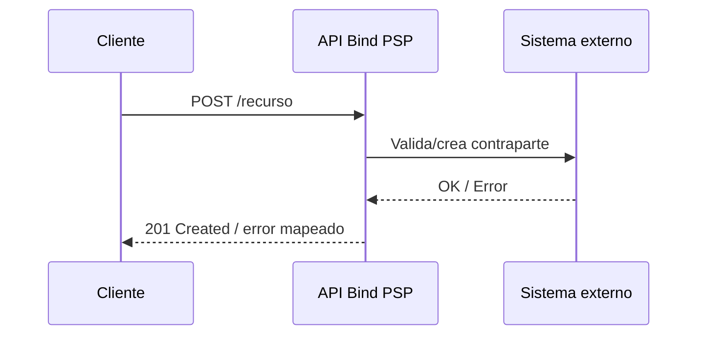

# Historia de usuario: [Título de la historia]

## Encabezado

| Campo | Valor |
|-------|-------|
| ID | [US-XXX] |
| Título | [Título breve descriptivo] |
| Persona | [Persona de usuario] |
| Prioridad | [P0/P1/P2] |
| Epic/Feature | [Feature o epic padre] |
| Estimación | [Story points o talle] |

## Enunciado

**Como** [persona de usuario específica],

**quiero** [acción o capacidad],

**para** [beneficio o valor que recibo].

## Contexto y antecedentes

<!-- ¿Por qué existe esta historia? ¿Qué problema resuelve? Link al PRD si existe. -->

[Contexto que explica la necesidad del usuario y cómo esta historia encaja en la feature más grande]

## Contrato de API

<!-- Solo si la historia construye, modifica o consume un endpoint. Si no aplica, borrar toda la sección.
Completar cada campo con un valor concreto — nunca dejar "a definir" salvo que se mueva
explícitamente a Preguntas abiertas. -->

| Campo | Valor |
|-------|-------|
| Estilo | [REST / GraphQL / gRPC / Webhook / WebSocket] |
| Método y recurso | [`POST /comitentes` — sustantivo plural, sin verbos en la URL] |
| Autenticación | [OAuth 2.0 / JWT Bearer / API Key / mTLS] |
| Headers obligatorios | [`Content-Type: application/json`, `X-Request-ID`, `Idempotency-Key` si aplica] |
| Versionado | [`/v1/` en el path / header `Accept-Version` / N/A si es endpoint nuevo sin historia previa] |
| Paginación/filtrado | [cursor-based / offset-based / N/A si no lista recursos] |
| Estrategia de borrado | [soft-delete / hard-delete / N/A si no aplica] |

### Request de ejemplo (caso éxito)

```json
{
  "campo": "valor"
}
```

### Response de ejemplo (caso éxito)

```json
{
  "id": "cta_123",
  "campo": "valor"
}
```

### Response de ejemplo (error — RFC 9457 problem+json)

```json
{
  "type": "https://bindpsp.com/errors/validacion",
  "title": "Error de validación",
  "status": 422,
  "detail": "El campo 'campo' no cumple el formato esperado",
  "instance": "/comitentes",
  "errors": [
    { "field": "campo", "reason": "formato inválido" }
  ]
}
```

## Criterios de aceptación

<!-- Formato Given/When/Then. Cada criterio debe ser testeable de forma independiente.
Si la historia describe un endpoint/API, cada AC relevante debería poder responder:
¿qué código de respuesta HTTP? ¿qué valida exactamente (formato, catálogo, existencia
del recurso)? ¿qué ejemplo de request/response ilustra este caso? No hace falta un
ejemplo completo en cada AC — alcanza con uno por desenlace distinto (éxito, error de
validación, error de negocio, recurso no encontrado). Ver referencia real completa:
1_proyectos/proyecto-remediar-onboarding/prd-208_alta_comitente_id_cuenta/artefactos/historias_alta_comitente_id_cuenta.md -->

### AC-1: [Título del criterio]

**Dado** [contexto inicial o precondición]

**Cuando** [acción tomada por el usuario]

**Entonces** [resultado esperado]

### AC-2: [Título del criterio]

**Dado** [contexto inicial o precondición]

**Cuando** [acción tomada por el usuario]

**Entonces** [resultado esperado]

### AC-3: [Título del criterio]

**Dado** [contexto inicial o precondición]

**Cuando** [acción tomada por el usuario]

**Entonces** [resultado esperado]

<!-- Si la historia describe un endpoint: sumar como mínimo un AC anti-BOLA (un usuario/cliente
no puede leer ni modificar el recurso de otro cambiando el ID) y, si crea o mueve dinero,
un AC de idempotencia (mismo Idempotency-Key + mismo body en un reintento no duplica el efecto). -->

### AC-4: Un usuario no puede acceder al recurso de otro (anti-BOLA)

**Dado** que el usuario A está autenticado

**Cuando** intenta leer/modificar un recurso cuyo `id` pertenece al usuario B (vía path o body)

**Entonces** el sistema responde `403 Forbidden` sin exponer si el recurso existe o no

## Diagrama de flujo

<!-- Solo si el flujo tiene ramas condicionales, reintentos, o más de un sistema/actor
involucrado y un texto lineal no alcanza para que Ingeniería lo visualice sin ambigüedad.
Si no aplica, borrar toda la sección. Usar flowchart para decisiones, sequenceDiagram para
intercambios entre sistemas. -->



## Notas de diseño

<!-- Link a mockups, consideraciones de UX o decisiones de diseño -->

- [Nota de diseño o link a Figma]
- [Consideración de UX]

## Notas técnicas

<!-- Pistas de implementación, restricciones técnicas o consideraciones de arquitectura -->

- [Nota técnica]
- [Restricción o consideración]

## Dependencias

<!-- Otras historias, sistemas externos, o equipos de los que depende esta historia -->

| Dependencia | Tipo | Estado |
|-------------|------|--------|
| [Dependencia 1] | [Historia/API/Equipo] | [Bloqueada/Lista] |
| [Dependencia 2] | [Historia/API/Equipo] | [Bloqueada/Lista] |

## Fuera de alcance

<!-- Marcá explícitamente qué NO cubre esta historia -->

- [Item excluido]
- [Item excluido]

## Preguntas abiertas

<!-- Preguntas sin resolver que pueden afectar la implementación -->

- [ ] [Pregunta 1]
- [ ] [Pregunta 2]
