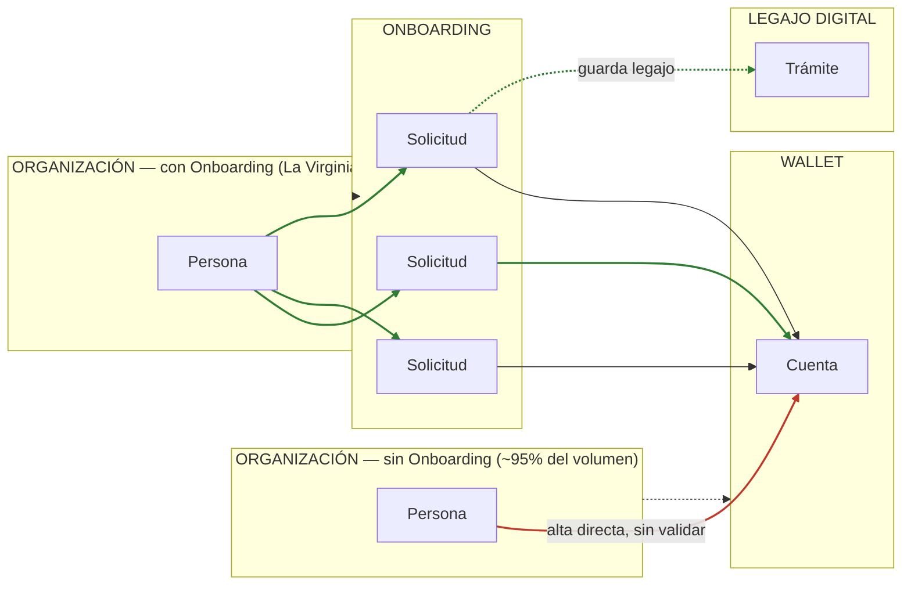
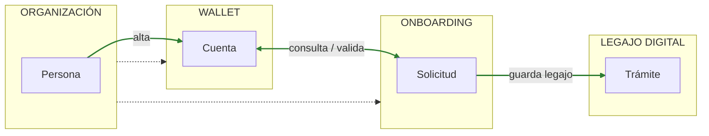
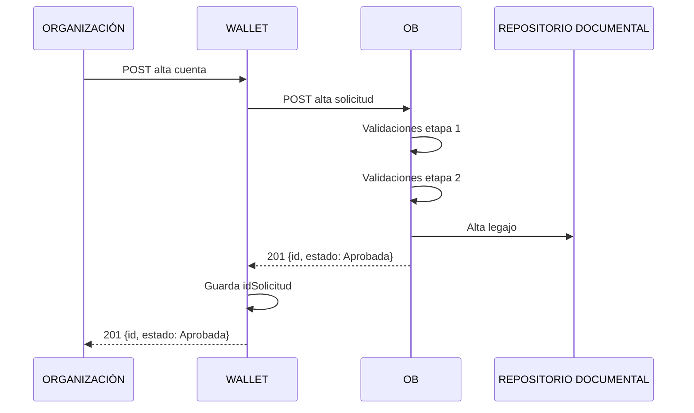
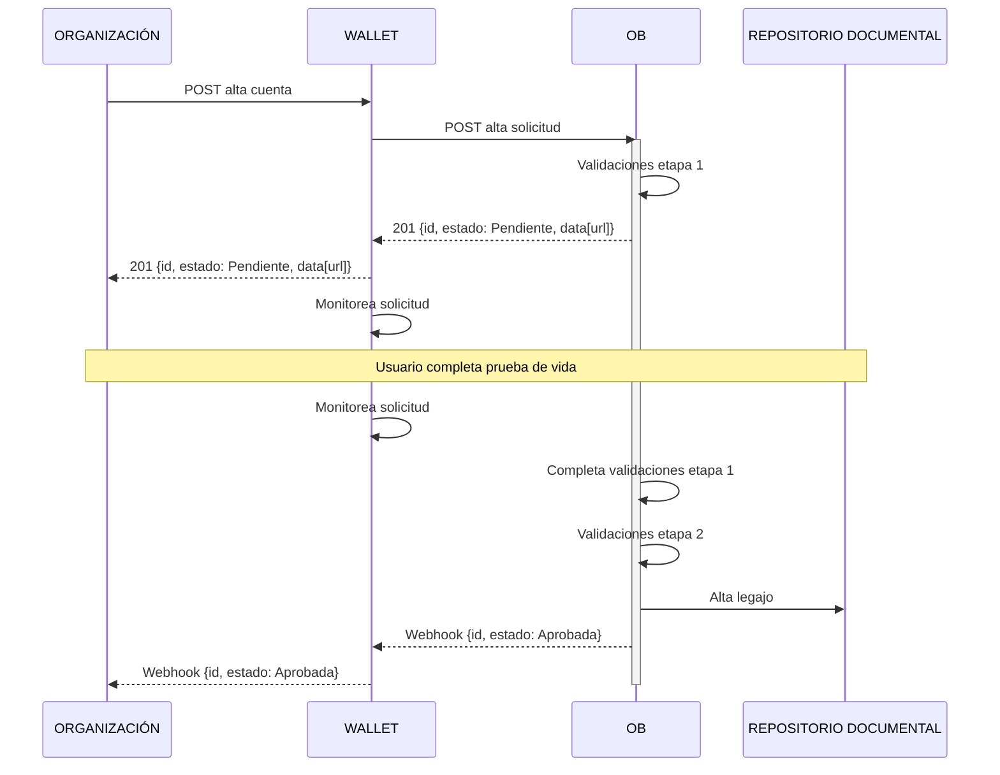

# Arquitectura interna de una solicitud de Onboarding — las 3 etapas y el modelo de flujo por entidad

> Estado: en producción.

> Fuente: reunión "OB - Alta cuenta comitente" (2026-07-22, Pablo Gomes explicando a Wallet — Gaston Agusti/Fintexa, Martín Hovanyecz/Juan Pablo Carubelli/Keep IT Simple, Nicolás Pomponio/Fintexa — la arquitectura general de Onboarding para dar contexto al proyecto [Onboarding Estratégico](../../../1_proyectos/proyecto-onboarding-estrategico/proyecto.md)). Complementa a [manuales_operativos.md](index.md) (cómo consultar una solicitud ya procesada) con el modelo conceptual de qué pasa **dentro** de una solicitud mientras se procesa.

## 0. Diagrama de estado actual (AS-IS) — los 2 caminos de alta hoy

Diagrama a mano aportado por Pablo Gomes en la reunión, mostrando cómo se da de alta una cuenta **hoy**, antes de este proyecto:

- **Camino A (rojo) — alta directa, sin pasar por Onboarding:** es el camino de **~95% del volumen actual** (~120.000 altas/mes, ver §5) — la organización manda la persona directo a crear la cuenta en Wallet, sin ninguna validación KYC. Es exactamente el problema que este proyecto (Onboarding Estratégico, KR1) busca remediar.
- **Camino B (verde) — vía Onboarding, modelo de hoy para La Virginia/Coppel:** la persona genera una **Solicitud** en Onboarding (una por organización/flujo, como se explica en §2); Onboarding es quien **hoy** crea la Cuenta en Wallet (no Wallet) y además guarda el trámite/legajo en **Legajo Digital**. Es el modelo que el "camino feliz" de §4 busca invertir: que sea Wallet quien cree la Cuenta una vez que Onboarding confirme la validación, no al revés.
- Los enlaces punteados organización→Wallet/Onboarding representan la relación de configuración a nivel entidad (credenciales/flujo), no el flujo de una solicitud puntual.

## 1. Las 3 etapas de una solicitud

Según Pablo Gomes, una solicitud de Onboarding pasa (conceptualmente, no siempre en este orden estricto) por 3 etapas:

1. **Etapa 1 — validaciones que requieren input externo (de la persona):** lectura de DNI, Renaper Datos (consulta si el DNI está vigente — necesita número de trámite del DNI, no siempre viene de leer el DNI: una organización puede pasar esos datos ya extraídos por OCR propio), Renaper Rostro (o la organización lo garantiza y solo se guarda como evidencia sin validar), prueba de vida (hoy solo vía **SocialNet**, proveedor externo — ver también [T-010](../../../2_areas/tareas.md) sobre el candidato FaceTec/FaceTech), OTP mail y OTP celular.
2. **Etapa 2 — validaciones sin input externo (consultas automáticas):** Arca, Worsis (Worldsys), lista 15 (Banco Industrial), totalizadores CBU/CVU — y dos que Onboarding ya soporta pero Bind PSP no usa todavía: scoring del medio y scoring del celular. Termina en un paso llamado **"validar matriz"**: suma un puntaje según los resultados de cada consulta y, si supera ciertos umbrales, marca la solicitud como **validación manual** o **rechazada** (ej.: si Worldsys marca a la persona como políticamente expuesta, el flujo puede configurarse para rechazar automático o mandar a validación manual).
3. **Etapa 3 — acciones finales ("Altas o acciones"):** solo se ejecuta si la solicitud superó la Etapa 1 y la Etapa 2. Hoy Onboarding hace acá el alta de cuenta, alta de CVU/CBU ("CB corta") y alta de comitente, y puede dar de alta un comercio. **Cambio que se busca con el proyecto:** que Onboarding deje de hacer todo esto y se limite a la parte KYC (dar de alta el legajo) — quien crea cuenta/CVU/comitente pasa a ser Wallet (ver decisión ya heredada en [`proyecto.md` §4.1](../../../1_proyectos/proyecto-onboarding-estrategico/proyecto.md)). **Punto abierto de diseño (2026-08-04):** en este proyecto es posible que se defina que esta etapa sea también donde ocurra el **alta del legajo en Worldsys** (`PRD-147`) — a diferencia de la consulta a Worldsys que ya corre en Etapa 2 (screening PLD, lectura), esto sería una acción de **escritura** (subir/informar el legajo), del mismo tipo que el guardado en Legajo Digital. Todavía no está cerrado si esa escritura vive acá o en otro punto del flujo — ver `proyecto.md` §6.

**Genericidad buscada:** el objetivo de diseño es que este modelo de 3 etapas no esté pensado "para Wallet" ni "para Comercio", sino para validar una persona en abstracto — que termine usando Wallet, un comercio, o nada.

**Nomenclatura alternativa (usada en el diseño de PRD-202, 2026-08-04):** en la documentación de contrato de API pensada para integradores externos se prefirió renombrar Etapa 1 → **"Validaciones iniciales de identidad"** y Etapa 2 → **"Validaciones con matriz"** — mismos conceptos, nombres más legibles fuera del equipo de producto. **Regla de orden confirmada:** las Validaciones con matriz solo corren después de que terminan **todas** las Validaciones iniciales de identidad, incluida la prueba de vida — si un flujo se frena en prueba de vida, la matriz todavía no corrió.

### 1bis. Comportamientos actuales confirmados durante el discovery de PRD-202 (2026-08-04)

Precisiones AS-IS que surgieron al diseñar el contrato de API del endpoint universal (ver [`1_proyectos/proyecto-onboarding-estrategico/prd-202_onboarding_consolidado/artefactos/flujos_caso1_sin_ob_por_api.md`](../../../1_proyectos/proyecto-onboarding-estrategico/prd-202_onboarding_consolidado/artefactos/flujos_caso1_sin_ob_por_api.md) para el diseño TO-BE completo del contrato):

- **Hoy Onboarding dispara webhook solo para solicitudes aprobadas** — no para rechazadas, en validación manual, con error de alta, ni vencidas. El rediseño de PRD-202 amplía esto a los 5 desenlaces relevantes.
- **Corrección (2026-08-04) — Onboarding sí tiene hoy un estado `Vencida` (`estado=9`)** para solicitudes pendientes que nunca se completan — confirmado por el usuario y visible en el enum de la API pública "Registro Único" (`apis_expuestas/registro_unico/endpoint_post_crear_solicitud.md`: `1=Pendiente, 2=Aprobada, 3=Rechazada, 4=Validación Manual, 5=Pendiente credenciales, 6=Error alta, 7=Aprobado a Revisar, 8=Aprobado sin notificar, 9=Vencida, 10=Menor pendiente, 11=Menor habilitado`). Transiciona correctamente, pero **no dispara webhook** — solo actualiza el estado internamente. El requisito real para el rediseño no es "agregar el estado", es **agregar la notificación por webhook cuando la solicitud vence**, coherente con el resto del rediseño (webhook para los 5 desenlaces relevantes, no solo aprobadas).
- **Los reintentos de extracción de datos del DNI (PDF417) son configurables por flujo desde el backoffice.** Renaper Rostro, en cambio, **no tiene reintentos configurables hoy** — decisión deliberada de no permitirlos: reintentar la validación de rostro (a diferencia de reintentar una foto de mala calidad) es el vector de un posible fraude de identidad (alguien probando distintas caras hasta que una valide — ver el caso GST en [`proyecto.md` §5](../../../1_proyectos/proyecto-onboarding-estrategico/proyecto.md) del proyecto).
- **Manejo de indisponibilidad de un servicio externo, distinto según la etapa:** en Etapa 2 (Validaciones con matriz), si un servicio no responde y falta su dato para calcular el puntaje, la solicitud queda en **validación manual** (no se rechaza) — backoffice puede reprocesar manualmente ese servicio puntual y la solicitud se completa sola. En Etapa 1 (Validaciones iniciales de identidad), en cambio, si un servicio crítico (ej. Renaper) no responde, la solicitud se **rechaza con un error marcado** — no tiene sentido continuar sin la validación de identidad más importante de todas.
- **El TTL de una solicitud pendiente es (o debería ser) un parámetro configurable por flujo**, no un valor único global para todo Onboarding.
- **El orden de los pasos que Onboarding espera recibir en un flujo lo define la configuración de ese flujo** (junto con sus palancas de validación) — no lo decide la organización mandando los datos en el orden que prefiera. Customizar ese orden por organización queda anotado como una posible feature de UX a futuro, no construida todavía.
- **🆕 Onboarding valida hoy la completitud del request contra la configuración del flujo *antes* de crear la solicitud, y rechaza sin crear nada si falta algo** — confirmado con evidencia de testing real de [PRD-108](../../../1_proyectos/proyecto-onboarding-estrategico/prd-108_legajo_altas_cuenta/proyecto.md) (HU1/HU2, `✅ PASS` en QA, Run #01 del 23/06/2026): `HTTP 422` con error `DOCUMENTO_REQUERIDO` (`{eventId, correlationId, errores: [{codigo, titulo, detalle}]}`), sin crear la solicitud. **Este comportamiento debe cambiar para el endpoint universal de PRD-202** — es un requisito explícito a pedir en el detalle técnico, no un efecto secundario de reciclar el endpoint de PRD-108 tal cual: sin el cambio, el flujo "por partes" no puede funcionar (cualquier campo ausente cortaría antes de que la organización pueda completar el resto después). Ver el detalle completo, con la distinción entre qué sí debe seguir bloqueando (formato/legibilidad, responsabilidad de Wallet) y qué debe dejar de hacerlo (completitud contra la configuración del flujo, responsabilidad de Onboarding), en [`flujos_caso1_sin_ob_por_api.md` §0.2bis/§0.2ter](../../../1_proyectos/proyecto-onboarding-estrategico/prd-202_onboarding_consolidado/artefactos/flujos_caso1_sin_ob_por_api.md).

## 2. Configuración por flujo/entidad

- En Onboarding, cada organización se modela como una **entidad**, y cada entidad consume un **flujo** configurado específicamente para ella (no hay un flujo genérico único). El flujo define, paso por paso, qué validaciones de la Etapa 1 corren y cuáles no (ej.: una organización con prueba de vida propia con otro proveedor puede tildar "no validar" ese paso y solo exigir la evidencia como archivo).
- Esta lógica de configuración **vive en Onboarding, no en Wallet** — es una decisión de diseño explícita: Wallet no debe encargarse de saber qué pasos aplican a qué organización.
- Cada flujo tiene muchos parámetros configurables (ejemplo mostrado en vivo: la entidad "La Virginia" en el panel de administración de Onboarding, con su propia matriz de riesgo).

## 3. Requisito nuevo: pausar y reanudar una solicitud

Hoy el único flujo existente exige que la organización mande toda la información de una sola vez (Onboarding valida todo junto). El cambio que se pide para el proyecto es que la solicitud pueda **avanzar con la información parcial que tenga**, quedar en estado "pendiente, falta X dato", y reanudarse cuando ese dato llegue — sin reiniciar el proceso. Es un pedido explícito de organizaciones que hoy quieren mandar primero el DNI (para Renaper Datos) y después el resto. Este cambio es transversal a toda la familia de IDEAs del proyecto (no es alcance de una sola).

## 4. El "camino feliz" propuesto para el alta de cuenta

Diagrama del estado objetivo (TO-BE) aportado por Pablo Gomes, a contrastar con el AS-IS de §0:

**Cambios respecto al AS-IS de §0:**
- La organización habla **solo con Wallet** — un único punto de entrada, sin importar si la persona necesita pasar por validación de Onboarding o no (a diferencia del AS-IS, donde había 2 caminos separados según si la organización tenía o no su propio Onboarding).
- La relación Wallet↔Onboarding pasa a ser **bidireccional y orquestada por Wallet**: Wallet crea/consulta la Solicitud en Onboarding y espera su resultado, en vez de que Onboarding le cree la Cuenta a Wallet como pasa hoy con La Virginia/Coppel.
- **Onboarding deja de crear la Cuenta** — solo valida y arma el legajo/trámite en Legajo Digital; quien crea la Cuenta en Wallet es siempre Wallet (ver decisión heredada en [`proyecto.md` §4.1](../../../1_proyectos/proyecto-onboarding-estrategico/proyecto.md) y la decisión de producto del 2026-07-21 en `0_direccion/decisiones.md`).
- Ya no aparecen "3 Solicitudes" en paralelo como en el AS-IS (una por organización con Onboarding propio) — el modelo se unifica: una única entidad de Onboarding con flujo configurable por organización (ver §2), consumida siempre a través de Wallet.

Flujo objetivo en pasos (asumiendo ya resuelta la orquestación Wallet→Onboarding, ver [`proyecto.md` §4.1](../../../1_proyectos/proyecto-onboarding-estrategico/proyecto.md)):

1. Wallet recibe el pedido de alta de la organización y crea una solicitud en Onboarding con toda la información recibida.
2. Onboarding corre Etapa 1 y Etapa 2 según el flujo configurado para esa entidad.
3. Si falta información obligatoria según el flujo, Onboarding responde "falta tal dato" — Wallet debe trasladar ese mismo mensaje a la organización tal cual (Wallet no sabe de validaciones, depende 100% de lo que le diga Onboarding).
4. Si la solicitud queda aprobada, Onboarding se lo confirma a Wallet y **recién ahí Wallet da de alta la cuenta** (ya no la da de alta Onboarding).

## 5. Sincronía vs. asincronía — el problema de fondo, sin resolver

- Volumen actual: **~120.000 altas de cuenta/mes**, de las cuales **~95% le pegan directo al alta de cuenta sin pasar por esta validación**.
- Para no romper la integración de organizaciones que hoy tienen su propio onboarding externo (BSF, Cencosud/"Senco", Carrefour, etc. — mismo listado de "5 organizaciones dominantes" ya documentado en [`proyecto.md` §4.5](../../../1_proyectos/proyecto-onboarding-estrategico/proyecto.md)), la premisa de trabajo es que el alta siga siendo **síncrona**: para ellas, casi todos los pasos de Etapa 1 se marcan "no validar" (ya validaron ellos antes de llegar a Bind), y solo corre la Etapa 2 (Arca, Worsis, lista15, totalizadores) — el flujo de "validar matriz" queda como validación estándar siempre activa.
- **Objeción de Gaston Agusti (Fintexa) y Juan Pablo Carubelli:** resolver todo síncrono es riesgoso — cualquier falla en Onboarding o en un proveedor externo (Arca, Worldsys) durante esas consultas encadenadas se traduce directo en una falla del alta de cuenta. Propuesta alternativa: devolver igual un `idCuenta` al toque (para no romper la experiencia actual del cliente), pero con la cuenta en un estado "pendiente"/"en onboarding" hasta que las validaciones terminen por detrás — con un webhook o polling avisando cuándo se habilita.
- **Sin cerrar todavía:** si el alta síncrona es la solución definitiva o solo una primera etapa mientras se negocia con cada cliente una migración a un modelo con estado pendiente. Pablo Gomes coincide con la objeción pero prioriza no cambiarle la experiencia al cliente en el corto plazo — el tema queda explícitamente para una próxima mesa técnica con todos los equipos.
- **Discusión derivada — separar el estado de la cuenta del estado de la solicitud:** hoy una cuenta de Wallet solo tiene estado habilitada/deshabilitada (usado para otras cosas, ej. fraude). Gaston Agusti propuso no reutilizar ese mismo campo para el estado de onboarding pendiente — mantenerlo como un estado distinto y más limpio, para no interferir con la lógica que ya usa habilitado/deshabilitado. Sin resolver todavía cómo se modela.
- **Impacto en la creación de CVU/CBU:** Juan Pablo Carubelli señaló que si la cuenta puede quedar en estado pendiente, el CVU/CBU **no debería crearse hasta que termine la validación** (crear un CVU sobre una cuenta todavía no validada no tiene sentido) — lo que implica que Wallet probablemente no deba crear el registro en la tabla de cuentas actual hasta tener la validación resuelta, sino en una estructura previa vinculada a un identificador de KYC/onboarding. Consecuencia adicional: el cliente ya no recibiría el CVU en la misma llamada que el `idCuenta` — haría falta un mecanismo (webhook o consulta) para avisarle cuándo está listo. Sin resolver, queda para la mesa técnica.

### 5.1 Diagrama de secuencia — caso síncrono (validaciones que no se frenan)

Diagrama a mano aportado por Pablo Gomes: el caso concreto en que la solicitud se puede resolver **síncronamente**, porque el flujo de esa entidad solo corre validaciones que no dependen de un tercero externo con demora variable (ej. las 5 organizaciones dominantes — BSF, Credicuotas, CENCOSUD, Sociedad Militar, Global 66 — que solo corren Etapa 2 sin captura de documento, ver [`proyecto.md` §4.5](../../../1_proyectos/proyecto-onboarding-estrategico/proyecto.md)):

- Es la materialización concreta del "camino feliz" de §4 para el segmento que **sí** puede resolverse en la misma llamada — todo ocurre dentro de una única cadena síncrona: Organización→Wallet→Onboarding→(validaciones + alta de legajo)→Wallet→Organización.
- **"Guarda idSolicitud"** en Wallet es el paso que materializa la decisión heredada de persistir el `idSolicitud` de Onboarding en cada cuenta nueva (ver [`proyecto.md` §4](../../../1_proyectos/proyecto-onboarding-estrategico/proyecto.md), decisión #1, y el mecanismo de correlación ya diseñado para PRD-208 en [`prd-208_alta_comitente_id_cuenta/proyecto.md §4`](../../../1_proyectos/proyecto-onboarding-estrategico/prd-208_alta_comitente_id_cuenta/proyecto.md)).
- **"Repositorio Documental"** es un nombre deliberadamente genérico en el diagrama — no especifica si es Legajo Digital o Worldsys, porque esa pregunta de arquitectura sigue sin resolver (ver riesgo en [`proyecto.md` §5](../../../1_proyectos/proyecto-onboarding-estrategico/proyecto.md)). El diseño de este flujo es válido para cualquiera de las dos resoluciones.
- No contradice la objeción de Gaston Agusti/Juan Pablo Carubelli de más arriba sobre el riesgo de resolver todo síncrono — este diagrama es justamente el caso "feliz" donde el riesgo no se materializa (ninguna validación depende de una espera externa impredecible, a diferencia de la prueba de vida vía SocialNet, ver §6). Para el segmento que sí necesita captura de documento/biometría, el patrón sigue siendo asíncrono (`PENDIENTE` + webhook).

### 5.2 Diagrama de secuencia — caso asíncrono (requiere prueba de vida)

Contracara del diagrama de §5.1, para el caso en que el flujo de la entidad exige un paso que depende de un tercero externo con demora variable (prueba de vida vía SocialNet, ver §6) y por lo tanto no puede resolverse en una sola llamada:

- El estado `Pendiente` + `data[url]` que Wallet devuelve a la Organización en la primera respuesta es la URL que el usuario final tiene que abrir para completar la prueba de vida (SocialNet) — coherente con lo explicado en §6: ni la Organización ni Wallet controlan cuándo el usuario la completa.
- Mientras tanto, Wallet queda "monitoreando la solicitud" (polling o consulta periódica a Onboarding) — el diagrama no resuelve si ese monitoreo es polling activo de Wallet o si Onboarding empuja el webhook sin que Wallet tenga que preguntar; ambos aparecen como pasos "Monitorea solicitud" separados por la marca de tiempo en que el usuario completa la prueba de vida.
- Una vez que Onboarding detecta que SocialNet confirmó la prueba de vida, retoma y completa la Etapa 1, corre la Etapa 2, da de alta el legajo y **dispara el webhook final a Wallet**, que a su vez lo reenvía a la Organización — mismo desenlace final (`Aprobada`) que el caso síncrono de §5.1, pero llegando por webhook en vez de por la respuesta original.

**⚠️ Nota de estado — ambos diagramas (§5.1 y §5.2) son borradores de diseño deseado, todavía no construidos:** el propio Pablo Gomes aclaró al aportarlos que son la propuesta de cómo debería funcionar el flujo una vez completado el proyecto Onboarding Estratégico, no una descripción de un sistema ya existente — a diferencia del diagrama AS-IS de §0, que sí describe el estado real de hoy. Antes de tomarlos como contrato de implementación, falta cerrar (ver riesgos en [`proyecto.md` §5](../../../1_proyectos/proyecto-onboarding-estrategico/proyecto.md)): quién orquesta formalmente (mesa técnica pendiente), el mecanismo exacto de "monitoreo" (polling vs. push), y la autenticación entidad-por-entidad de las consultas Wallet↔Onboarding.

## 6. Prueba de vida vía SocialNet — ejemplo de dependencia externa asíncrona por naturaleza

Cuando el flujo de una entidad exige prueba de vida, Onboarding no puede resolverlo en la misma llamada: crea la solicitud en SocialNet (el proveedor), recibe una URL, y esa URL debe llegar de alguna forma al usuario final para que la complete **fuera** de Onboarding — ni la organización ni Wallet se enteran de cuándo el usuario la completó. Onboarding queda monitoreando a SocialNet; cuando SocialNet confirma, Onboarding continúa el flujo solo y al final dispara un webhook (hoy se lo tira a la organización directamente; a futuro podría tirárselo a Wallet). Es el ejemplo más claro de por qué el patrón asíncrono (`PENDIENTE` + webhook) es indispensable para el segmento que sí necesita captura de biometría — ver decisión ya heredada #5 en [`proyecto.md` §4](../../../1_proyectos/proyecto-onboarding-estrategico/proyecto.md).

## 7. Prioridades de desarrollo (reafirmadas en esta reunión)

1. Personas físicas mayores de Wallet (99% del volumen de altas de Wallet hoy).
2. Personas menores (drivers comerciales: Coppel, Arcos Dorados).
3. Personas jurídicas (requiere validar también a la persona física representante — más complejo, menor volumen).
Comercios quedan últimos: hoy se crean casi manualmente, sin flujo de alta relevante.

## 8. Riesgo de arquitectura: componente intermedio que conoce múltiples productos

Gaston Agusti (Fintexa) planteó una objeción de fondo al patrón de "orquestador nuevo" (la 3ª alternativa de orquestación, ver [`proyecto.md` §5](../../../1_proyectos/proyecto-onboarding-estrategico/proyecto.md)): un componente que necesita conocer el detalle de varios productos (Wallet + Comercio, por ejemplo) complica los despliegues y genera dependencias cruzadas indeseadas — citó como precedente negativo un componente compartido entre Aceptador y otro producto ("W center") que en la práctica volvió muy difícil coordinar cambios entre equipos. Conclusión de la reunión: por ahora Wallet (el producto con más control de la experiencia del cliente) asume la orquestación, en vez de crear una entidad nueva — pero se deja explícitamente anotado como problema futuro sin resolver para el caso de clientes que necesiten dar de alta Wallet **y** Comercio juntos (ej. Surfin), donde este patrón (Wallet orquesta) no alcanza porque Wallet no puede dar de alta el comercio del lado de Cobro/Adquirencia.

---
*Última actualización: 2026-08-04 (4) — Corregido el hallazgo sobre el estado `VENCIDA`: sí existe hoy (`estado=9`, confirmado por el usuario y visible en la API pública de Registro Único), transiciona bien, pero no dispara webhook — el requisito real es agregar esa notificación, no crear el estado.*
*Última actualización anterior: 2026-08-04 (3) — §1bis suma hallazgo con evidencia de testing de PRD-108: Onboarding hoy rechaza con `422 DOCUMENTO_REQUERIDO` sin crear la solicitud si falta un dato/documento exigido por la configuración del flujo — comportamiento que debe cambiar para el endpoint universal de PRD-202, requisito explícito a pedir en el detalle técnico.*
*Última actualización anterior: 2026-08-04 (2) — §1 nombra formalmente la Etapa 3 como "Altas o acciones" y agrega el punto abierto de diseño de si el alta de legajo en Worldsys (PRD-147) vive en esta etapa — distinto de la consulta a Worldsys que ya corre en Etapa 2.*
*Última actualización anterior: 2026-08-04 — `/debrief` de la sesión de diseño de PRD-202 (contrato de API del endpoint universal): nueva nomenclatura alternativa de las etapas (§1) y nueva §1bis con 6 comportamientos AS-IS confirmados (webhook solo para aprobadas hoy, sin estado VENCIDO, reintentos de Renaper Rostro deliberadamente sin configurar, manejo distinto de indisponibilidad externa por etapa, TTL y orden de pasos como parámetros de flujo).*
*Última actualización anterior: 2026-07-22 (5) — suma el diagrama de secuencia del caso asíncrono (§5.2, requiere prueba de vida), aportado como imagen por el usuario. Aclaración importante del usuario: §5.1 y §5.2 son borradores del diseño deseado, todavía no construidos — a diferencia del AS-IS de §0.*
*Última actualización anterior: 2026-07-22 (4) — suma el diagrama de secuencia del caso síncrono (§5.1), aportado como imagen por el usuario.*
*Última actualización anterior: 2026-07-22 (3) — suma el diagrama TO-BE (§4) del flujo objetivo post-proyecto, aportado como imagen por el usuario.*
*Última actualización anterior: 2026-07-22 (2) — suma el diagrama AS-IS (§0) de los 2 caminos de alta actuales, aportado como imagen por el usuario en el mismo día de la ingesta.*
*Creado: 2026-07-22 — primera ingesta de este tema, a partir de la explicación de arquitectura general que Pablo Gomes dio al equipo de Wallet.*
